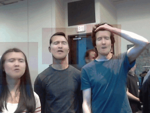

# MoreMori

## Introduction

We perform a faceswap from anyone's face to Greg Mori. Greg Mori is a professor at SFU.

A variety of previous work exists regarding the use of [CycleGAN](https://github.com/junyanz/pytorch-CycleGAN-and-pix2pix) 
for style transfers. CycleGAN has wide-ranging applications, and is not specific to human faces. 
[DeepFake](https://github.com/deepfakes/faceswap) builds on CycleGAN by mapping face-specific features to assist in 
alignment of features during transfer. 

We used a data-centric approach, leaving the networks of CycleGAN unmodified. This allowed us to explore the effects of 
data inputs on training and testing results with a known-good network.

We perform a unique data augmentation. The corresponding paper and poster for this project is available in the folder
[docs](docs).

## Examples

Swapping internet celebrity [Lucia Liu](https://www.instagram.com/luseeyalu/?hl=en) to 
[my face](https://avatars0.githubusercontent.com/u/16661180?s=400&v=4) 
<br/>


Swapping [Donald Trump](https://en.wikipedia.org/wiki/Donald_Trump) to actor 
[Nicolas Cage](https://en.wikipedia.org/wiki/Nicolas_Cage)
<br/>


A Real time demonstration. Faceswapping is done with anyone's face to professor 
[Greg Mori](http://www.cs.sfu.ca/~mori/). The background changes colour, but overall the results are promising.
<br/>


## Setup

To download CycleGAN and add the augmentation files to CycleGAN, run <br/>
`bash setup.sh`

### Training

The training commands are the same as the original CycleGAN <br/>
`python3 train.py --dataroot ./path_to_data --name model_name --model cycle_gan`

However, the files in the dataroot will be slightly different.

Recall CycleGAN has 4 folders in the dataroot: <br/>
`testA`, `testB`, `trainA`, and `trainB`. <br/>
For our CycleGAN, the images in `testA`, `testB`, `trainA`, and `trainB` need to be **segmented**. We also add two folders: <br/>
`testBG`, and `trainBG`. <br/>
The images in the folders will be the backgrounds we augment with.<br/>
<br/>
It is recommended you put the **unsegmented** images from `testA` and `testB` in `testBG`. Similarly, <br/>
it is recommended you put the **unsegmented** images from `trainA` and `trainB` in `trainBG`. <br/>

### Testing

The project will run on your computer's camera with<br/>
`main.py -n path/to/model.pth`

### Prequisites
cmake<br/>
[condas](https://conda.io/miniconda.html)

### Installation

```
conda env create -f more_mori_env.yml
source activate more_mori_env
pip install -r requirements.txt
```
